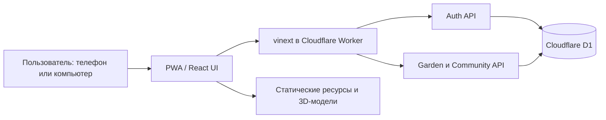
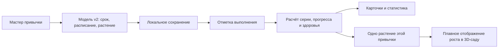
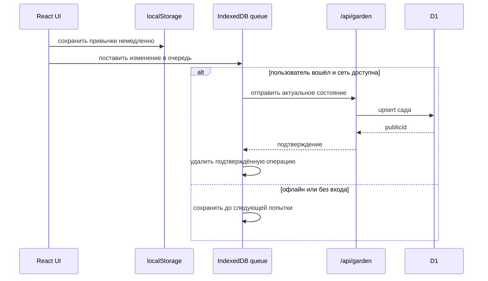
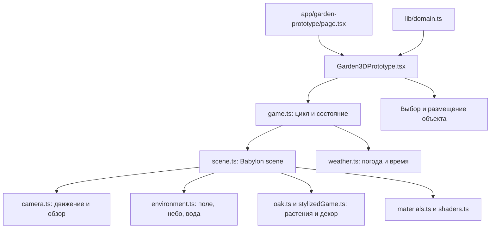
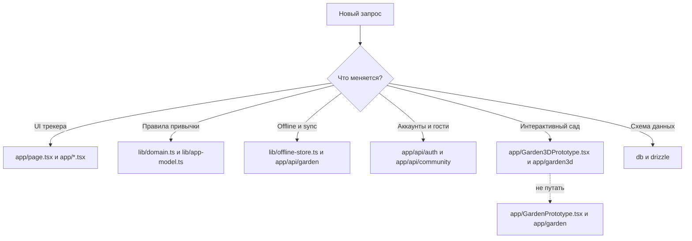
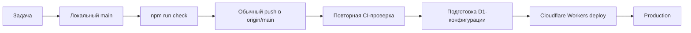

# Архитектура «Рост»

## Контекст системы

## Жизненный цикл привычки и растения

## Offline-first синхронизация

## Активный 3D-сад

`app/GardenPrototype.tsx` и `app/garden/` относятся к старому 2D/canvas-прототипу и не входят в активный граф.

## Маршрутизатор задач агента

## Git и выпуск

## Ключевые границы

- UI не вычисляет рост самостоятельно: он использует функции доменного слоя.
- 3D-сцена не владеет привычками и не является источником истины.
- API проверяет авторизацию и входные данные до обращения к D1.
- Локальная запись выполняется раньше сетевой синхронизации.
- Изменение сохранённой модели требует миграции старых локальных и серверных данных.
