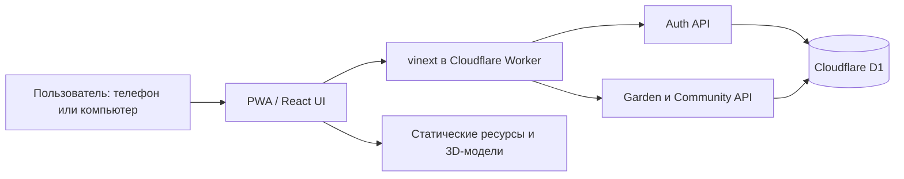
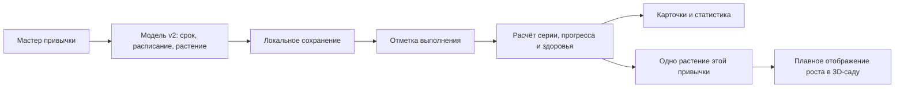
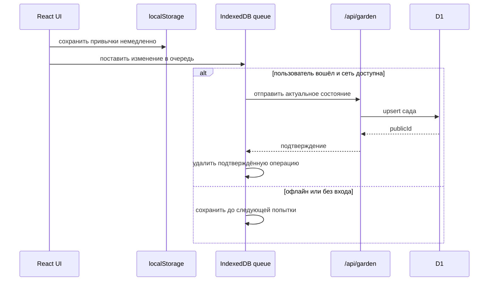
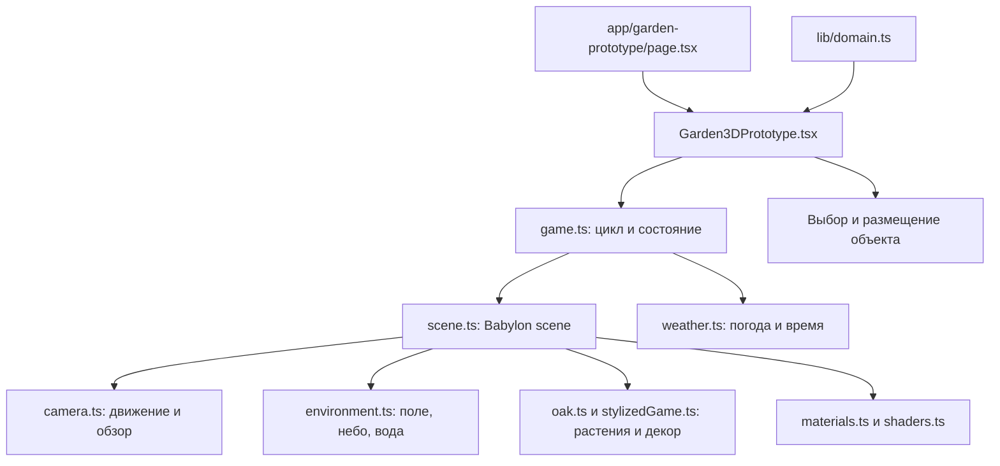
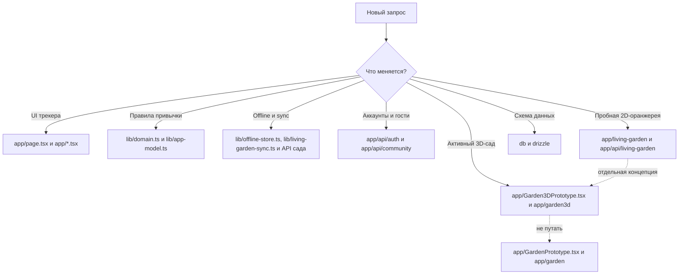
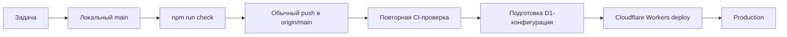

# Архитектура «Рост»

## Контекст системы

```mermaid
flowchart LR
  User[Пользователь: телефон или компьютер] --> PWA[PWA / React UI]
  PWA --> Worker[vinext в Cloudflare Worker]
  Worker --> Auth[Auth API]
  Worker --> Garden[Garden и Community API]
  Auth --> D1[(Cloudflare D1)]
  Garden --> D1
  PWA --> Assets[Статические ресурсы и 3D-модели]
```

## Жизненный цикл привычки и растения

```mermaid
flowchart LR
  Wizard[Мастер привычки] --> Model[Модель v2: срок, расписание, растение]
  Model --> Local[Локальное сохранение]
  Local --> Complete[Отметка выполнения]
  Complete --> Domain[Расчёт серии, прогресса и здоровья]
  Domain --> View[Карточки и статистика]
  Domain --> Plant[Одно растение этой привычки]
  Plant --> Scene[Плавное отображение роста в 3D-саду]
```

## Offline-first синхронизация

```mermaid
sequenceDiagram
  participant UI as React UI
  participant LS as localStorage
  participant Q as IndexedDB queue
  participant API as /api/garden
  participant DB as D1
  UI->>LS: сохранить привычки немедленно
  UI->>Q: поставить изменение в очередь
  alt пользователь вошёл и сеть доступна
    Q->>API: отправить актуальное состояние
    API->>DB: upsert сада
    DB-->>API: publicId
    API-->>Q: подтверждение
    Q->>Q: удалить подтверждённую операцию
  else офлайн или без входа
    Q->>Q: сохранить до следующей попытки
  end
```

## Активный 3D-сад

```mermaid
flowchart TD
  Route[app/garden-prototype/page.tsx] --> Shell[Garden3DPrototype.tsx]
  Shell --> Game[game.ts: цикл и состояние]
  Game --> Scene[scene.ts: Babylon scene]
  Scene --> Camera[camera.ts: движение и обзор]
  Scene --> Environment[environment.ts: поле, небо, вода]
  Scene --> Plants[oak.ts и stylizedGame.ts: растения и декор]
  Scene --> Materials[materials.ts и shaders.ts]
  Game --> Weather[weather.ts: погода и время]
  Shell --> Placement[Выбор и размещение объекта]
  Domain[lib/domain.ts] --> Shell
```

`app/GardenPrototype.tsx` и `app/garden/` относятся к старому 2D/canvas-прототипу и не входят в активный граф.

## Пробная 2D-оранжерея

```mermaid
flowchart LR
  Route[app/living-garden/page.tsx] --> Prototype[LivingPlantsPrototype.tsx]
  Prototype --> Plants[public/plants/growth/вид/NN.png: 30 независимых физиологических кадров]
  Prototype --> DemoState[Локальный снимок living garden v1]
  DemoState --> Sync[lib/living-garden-sync.ts: проверка и объединение]
  Sync --> API[/api/living-garden]
  API --> D1[(D1: отдельный living_garden_json)]
  DemoState --> Growth[Последовательное затухание старого и появление нового кадра]
  DemoState --> Checklist[Привычки слева: выбор, галочка и расписание]
  DemoState --> Stage[Выбранное растение справа: 30 стадий роста и продолжение до выбранного рубежа]
  DemoState --> Reminders[Частота и напоминание выбранной привычки]
  DemoState --> Care[Поддержка и обмен очков постоянства на уход]
  DemoState --> Achievements[Достижения, награды и лавка редких растений]
  DemoState --> Statistics[Месячная статистика из реальных дат выполнений]
  Care --> Decorations[Видимые украшения рядом с выбранным растением]
```

Маршрут `/living-garden` — отдельная визуальная концепция, которая не меняет основную сохранённую модель привычек или активную 3D-сцену. Без входа снимок сада сохраняется в `localStorage`. После регистрации или входа тот же снимок синхронизируется через `/api/living-garden` в отдельных колонках D1, не перезаписывая `habitsJson` основного dashboard. Сервер и клиент объединяют выполненные даты, покупки, завершения и достижения по стабильным идентификаторам; отметки, сделанные на разных устройствах, складываются. Вкладка «Статистика» вычисляется из этого же снимка в `lib/living-garden-statistics.ts`: она показывает выбранный месяц, календарь действий, недельные итоги и результат каждой привычки. Целевой ритм начинается с `createdAt`, учитывает частоту, выбранный срок и оставшиеся отметки, поэтому прошлые этапы без дат не превращаются в фиктивную историю или пропуски. Пользователь выбирает рубеж 30, 60 или 90 дней; первые 30 реальных отметок управляют физиологическими кадрами роста, а последующие сохраняются как продолжение рядом со зрелым растением. Достигнутый рубеж фиксируется в `rewardedGoals`, один раз приносит награду и сохраняет растение в «Саду успехов» через `completedAt`. После поздравления привычку можно завершить или продлить ещё на 30 дней до 360; `continuationDates`, `goalDays`, `rewardedGoals` и самая ранняя дата успеха объединяются между устройствами обратно совместимо. В поздравлении нет обещания «сформировать привычку за 30 дней»: оно объясняет, что автоматичность часто развивается за 2–5 месяцев, сильно различается между людьми и поддерживается повторением в похожем контексте. В прототипе одна цель по-прежнему соответствует одному выбранному растению; декоративные взаимодействия не увеличивают прогресс. Восемь видов — подсолнух, томат, лаванда, монстера, дуб, яблоня, пион и сакура — имеют по 30 последовательных физиологических кадров от семени до зрелой формы. Кадры хранятся отдельными прозрачными изображениями с безопасными полями. В покое отображается ровно один кадр, а подтверждение действия сначала гасит прежний и только затем показывает новый. Поэтому изображения не накладываются, соседние стадии не попадают в область просмотра, а листья и кроны не обрезаются. Главная рабочая область показывает список привычек слева и выбранное растение справа: нажатие одновременно выбирает привычку, ставит галочку и запускает видимый рост. Рядом с растением находятся тёплая забота, видимые украшения, календарь отметок, частота, напоминание и хорошо читаемое поддерживающее сообщение. Ниже собраны растения пользователя, достижения с получаемыми наградами и лавка, где очки постоянства открывают редкие виды; очки не заменяют реальные выполнения.

## Маршрутизатор задач агента

```mermaid
flowchart TD
  Request[Новый запрос] --> Kind{Что меняется?}
  Kind -->|UI трекера| Dashboard[app/page.tsx и app/*.tsx]
  Kind -->|Правила привычки| Domain[lib/domain.ts и lib/app-model.ts]
  Kind -->|Offline и sync| Storage[lib/offline-store.ts, lib/living-garden-sync.ts и API сада]
  Kind -->|Аккаунты и гости| API[app/api/auth и app/api/community]
  Kind -->|Активный 3D-сад| Active3D[app/Garden3DPrototype.tsx и app/garden3d]
  Kind -->|Пробная 2D-оранжерея| Living2D[app/living-garden и app/api/living-garden]
  Kind -->|Схема данных| Database[db и drizzle]
  Active3D -. не путать .-> Legacy[app/GardenPrototype.tsx и app/garden]
  Living2D -. отдельная концепция .-> Active3D
```

## Git и выпуск

```mermaid
flowchart LR
  Task[Задача] --> Main[Локальный main]
  Main --> Checks[npm run check]
  Checks --> Push[Обычный push в origin/main]
  Push --> CI[Повторная CI-проверка]
  CI --> Prepare[Подготовка D1-конфигурации]
  Prepare --> Deploy[Cloudflare Workers deploy]
  Deploy --> Prod[Production]
```

## Ключевые границы

- UI не вычисляет рост самостоятельно: он использует функции доменного слоя.
- 3D-сцена не владеет привычками и не является источником истины.
- API проверяет авторизацию и входные данные до обращения к D1.
- Локальная запись выполняется раньше сетевой синхронизации.
- Изменение сохранённой модели требует миграции старых локальных и серверных данных.
